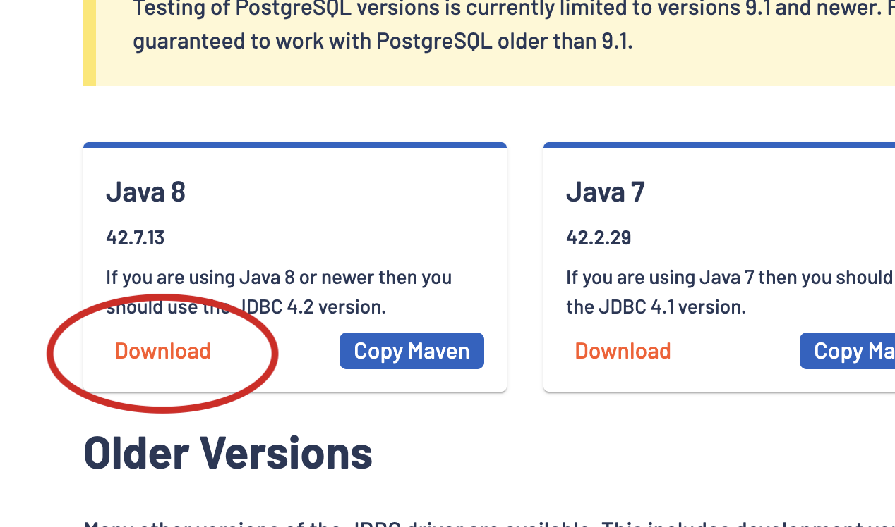
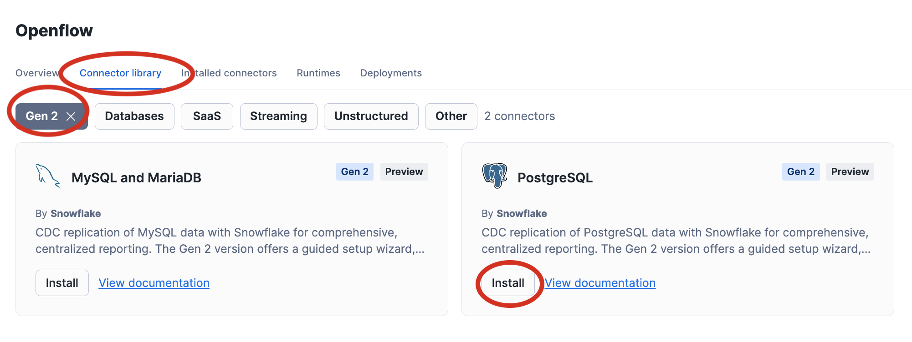
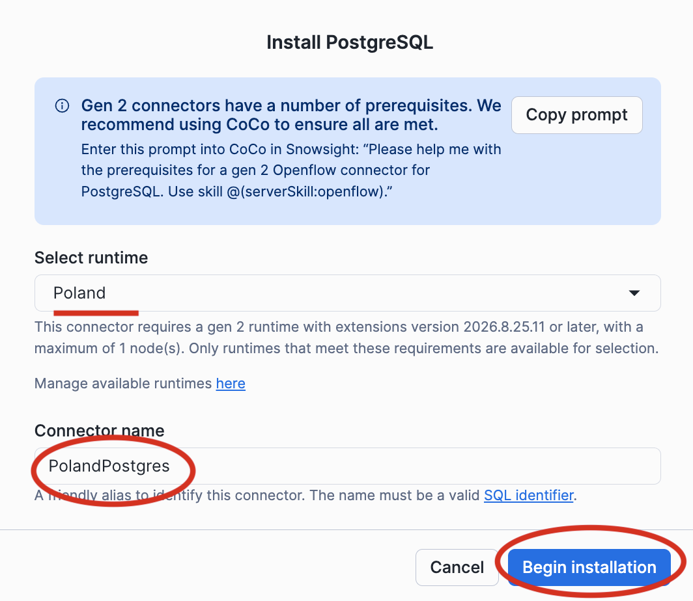
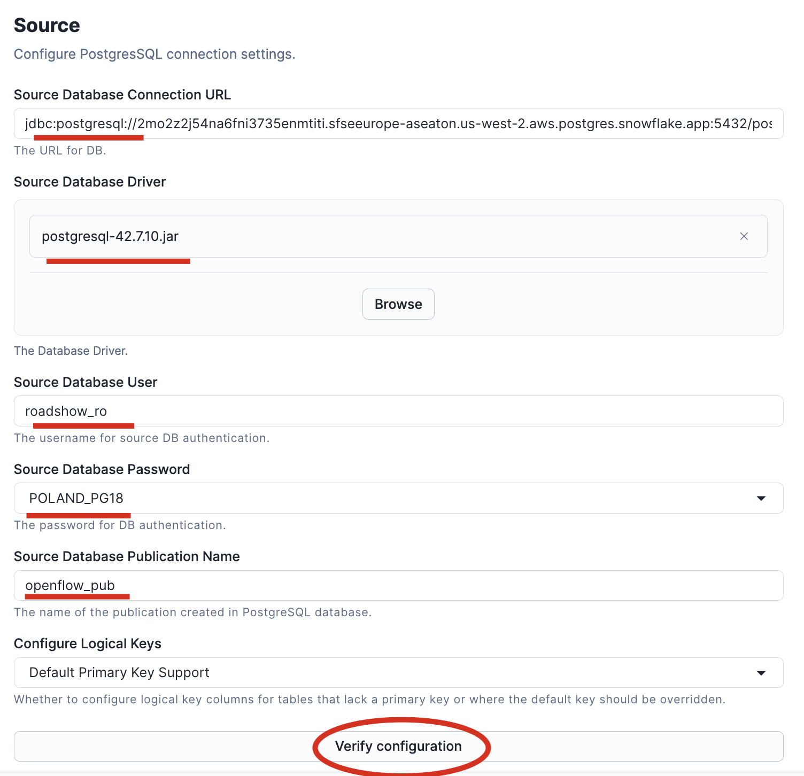
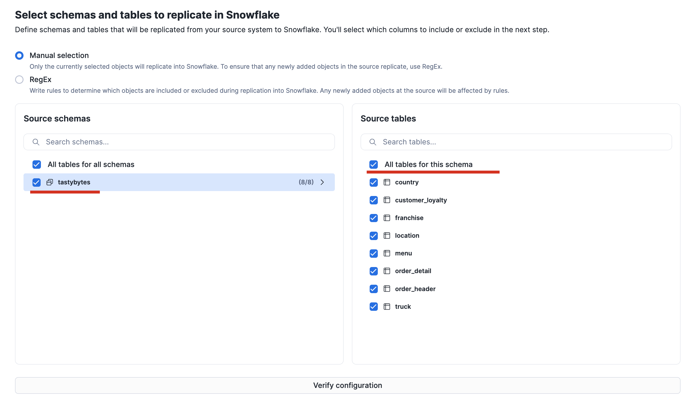
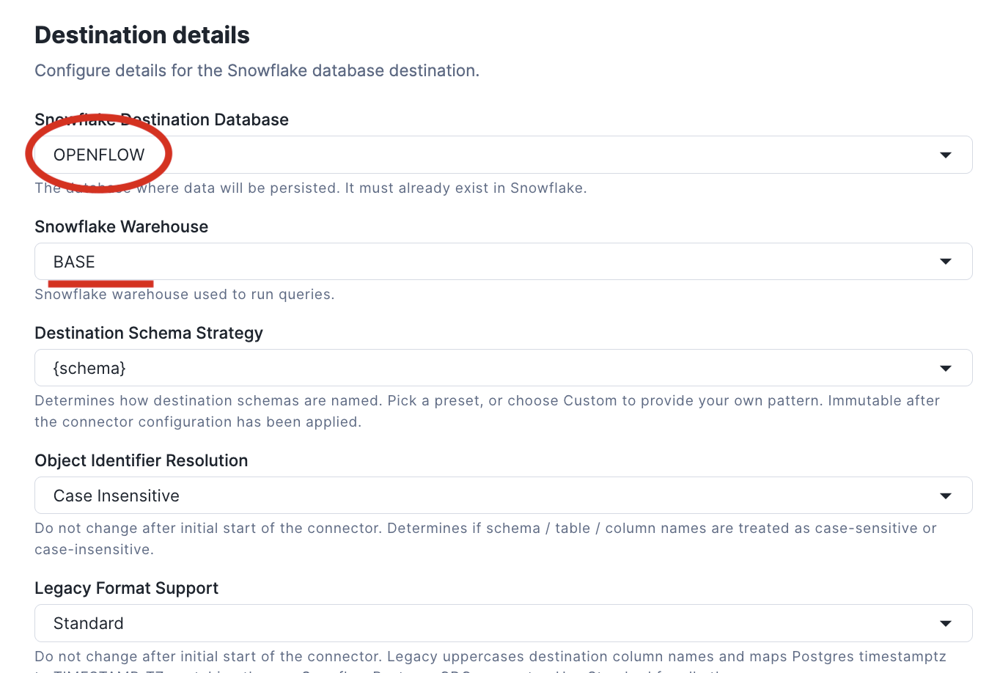
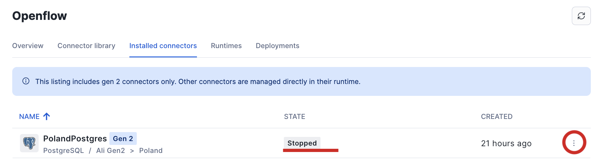
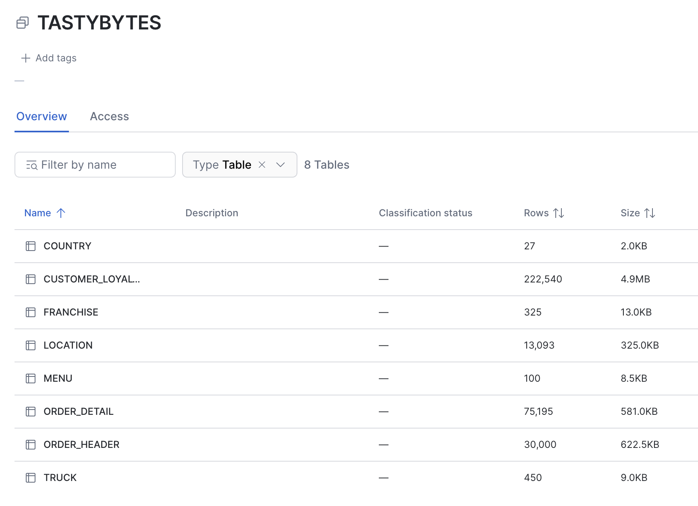

# Lab 01 - Database Integration

Before deploying the Postgres CDC connector we need to prepare a few things, first create the required password as a SECRET in snowflake

```
USE ROLE OPENFLOW_ADMIN;
CREATE SECRET OPENFLOW.OPENFLOW.poland_pg18
  TYPE = GENERIC_STRING
  SECRET_STRING = 'Warsaw2026!';

GRANT READ ON SECRET OPENFLOW.OPENFLOW.poland_pg18 TO ROLE OPENFLOW_RUNTIME;
```

[!CAUTION]
Also ensure you creating the Network rule described in [Lab 00](Lab%2000%20-%20Initial%20Setup.md) to allow access to the Postgres DB we will use for the lab

Now download the latest Postgres JDBC driver:
[https://jdbc.postgresql.org/download/](https://jdbc.postgresql.org/download/)



Now let's proceed with the connector deployment from the Openflow Control UI



Select your runtime and give your connector a name



Configure the connector with the following values

|Parameter|Value|
|--|--|
|Source Database Connection URL|`jdbc:postgresql://2mo2z2j54na6fni3735enmtiti.sfseeurope-aseaton.us-west-2.aws.postgres.snowflake.app:5432/postgres`|
|Source Database Driver|(upload) `postgresql-42.7.13.jar`|
|Source Database User|`roadshow_ro`|
|Source Database Password|(upload) `POLAND_PG18`|
|Source Database Publication Name|`openflow_pub`|



Select all tables in the tastybytes schema and click Next. For colum-level replication behaviour just accept the defaults and click Next



For Destination details, specify OPENFLOW as the target database, and choose your Snowflake Warehouse. For all other settings you can accept the defaults. Read and understand the options made available but you do not need to change anything



Tuning and Migration details can all be left as default values. Once on the final Summary page click Verify configuration and once the validation is succesfully completed, choose Apply. The connector will now deploy.



Once the connector has deploy, click the 3 dot context menu and choose Start. After the connector has had time to start processing observe in Snowsight that the schema OPENFLOW.TASTYBYTES has been created and populated with tables from the source Postgres



Navigate to the Connector Observability dashboard (Ingestion -> Openflow), check metrics, status and validate everything is correct. Now in class we will start populating changes to view the behaviour

# Lab 01b - Manual flow (Advanced)

Manually build a flow for custom database integration. This is more complicated and requires some experience (and/or exploration!)

**Tips:**
* Start on Openflow Canvas
* Create a Processor Group and work inside it
* Create a Parameter Context and add a Parameter to reference an asset - upload the Postgres driver jar
* Create a DBCPConnectionPool Controller Service, configure and enable
* You'll also need to create JsonRecordSetWriter and a StandardWebClientServiceProvider controller services (enable with default settings)
* Create a simple flow QueryDatabaseTableRecord → PublishSnowpipeStreaming
* Source table is tastybytes.order_header, specify your DB connection pool and record writer
* Try a Run Once and view the results in the queue, download the JSON file to help with target table creation
* Create the target table with all columns using the Snowsight UI loader and JSON file
* Setup the target PublishSnowpipeStreaming processor and Run! (Run Once behaviour with this processor is undefined due to more complex interactions with the pipe)


