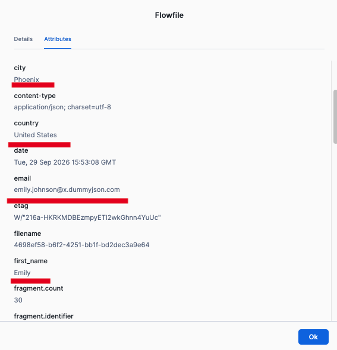

# Lab 02 - Custom HTTP API
In this lab we will build a custom flow directly on the Openflow canvas. It is more complex than just configuring a wizard but opens up unlimited flexibility with integrating different data sources. It is especially useful for integrating an HTTP REST API for which there is no existing connector provided by Snowflake.

## APIs Used

Both APIs are on the same host (`dummyjson.com`), free, no authentication required.

> 💡 Ensure you created the network rule described in [Lab 00](Lab%2000%20-%20Initial%20Setup.md) to allow access to the dummyjson.com API we will use for the lab

| API | URL |
|-----|-----|
| Users | `GET https://dummyjson.com/users?limit=30&select=id,firstName,lastName,email,address` |
| Carts | `GET https://dummyjson.com/carts/user/{userId}` |

## Building Technique

We will use a sequential build-and-test process, which is good for learning and is also a common development technique. We will build one step, test it, check the results are as expected and keep moving forward.

All the properties in this exercise that must be set or changed are listed; leave everything else at its default value.

### Process Group

Place a Process Group on the canvas (fourth icon in the toolbar), give it a name and double-click it to enter

---

### Processor 1: GenerateFlowFile

This processor is used to create an empty flowfile which will serve as a trigger for our flow. We'll set the run schedule to one hour to avoid it running constantly in case the processor is left running. For the lab, you will trigger it manually with right-click > **"Run once"**.

| Property | Value |
|----------|-------|
| **Name** | `Trigger` |
| **Scheduling** | Run Schedule: `1 hour` |

---

### Processor 2: InvokeHTTP

This processor sends an HTTP GET request to the API and writes the returned JSON document to a flowfile

| Property | Value |
|----------|-------|
| **Name** | `Fetch Users` |
| HTTP Method | `GET` |
| HTTP URL | `https://dummyjson.com/users?limit=30&select=id,firstName,lastName,email,address` |

**Relationships:** Set terminate for Failure, No Retry, Original, Retry

**Add Connection:** Connect Step 1. `Trigger` processor -> Step 2. `Fetch Users` processor -> on relationship `success`
(drag and drop from the middle of the first processor to the second one)


Now right-click the Trigger processor and choose **Run once** from the menu. It happens fast; to update the GUI, right-click the canvas and choose **Refresh**. You should now see 1 flowfile queued in the `success` queue. This is just an empty flowfile that we will use to trigger the whole flow.

---

### Processor 3: SplitJson

This processor will split the single large JSON document in the flowfile into several flowfiles, with one flowfile for each user in the JSON array (as specified by the JsonPath Expression)

| Property | Value |
|----------|-------|
| **Name** | `Split Users` |
| JsonPath Expression | `$.users[*]` |

**Relationships:** Set terminate for failure, original

**Add Connection:** Connect Step 2. `Fetch Users` processor -> Step 3. `Split Users` processor -> on relationship `Response`

Now that the next processor is connected, we can **Run once** the `Fetch Users` InvokeHTTP processor. This checks connectivity and confirms we set up the network rule correctly. Right-click `Fetch Users`, choose **Run once** and refresh the canvas - if there are no problems you should see 1 flowfile in the `Response` queue.


Right-click the queue and choose **List queue** to see the flowfiles in that queue. This is a useful technique for debugging and understanding what is flowing through your pipeline


If you have more than one flowfile you can identify the most recent by its queued duration. For more detail, click the 3 dot context menu, where you can view details or content, or download the file. View the content and validate you have a JSON response from the API

---

### Processor 4: EvaluateJsonPath

This processor extracts individual values from the JSON and writes them to flowfile attributes. To create dynamic properties click the "+" button as shown below


| Property | Value |
|----------|-------|
| **Name** | `Extract User Info` |
| Destination | `flowfile-attribute` |
| Return Type | `auto-detect` |

**Dynamic properties** (click "+" to add each one):

| Property name | Value |
|---------------|-------|
| `user_id` | `$.id` |
| `first_name` | `$.firstName` |
| `last_name` | `$.lastName` |
| `email` | `$.email` |
| `city` | `$.address.city` |
| `country` | `$.address.country` |

**Relationships:** Set terminate for failure, unmatched

**Add Connection:** Connect Step 3. `Split Users` processor -> Step 4. `Extract User Info` processor -> on relationship `split`

Now you can **Run once** the `Split Users` processor to check it successfully splits the JSON in the single flowfile into ~30 individual flowfiles, one per user. Once the next processor is connected, a **Run once** of `Extract User Info` lets you list the queue and view a flowfile's **Attributes** tab to check the extracted values:



---

### Processor 5: InvokeHTTP

| Property | Value |
|----------|-------|
| **Name** | `Fetch Cart` |
| HTTP Method | `GET` |
| HTTP URL | `https://dummyjson.com/carts/user/${user_id}` |

The `${user_id}` is NiFi Expression Language — it reads the FlowFile attribute set by Step 4. This is how we parameterize the second API call per user.

**Relationships:** Set terminate for Original, Retry, No Retry, Failure

**Add Connection:** Connect Step 4. `Extract User Info` processor -> Step 5. `Fetch Cart` processor -> on relationship `matched`

---

### Processor 6: EvaluateJsonPath

| Property | Value |
|----------|-------|
| **Name** | `Extract Cart Totals` |
| Destination | `flowfile-attribute` |
| Return Type | `auto-detect` |

**Dynamic properties:**

| Property name | Value |
|---------------|-------|
| `cart_total` | `$.carts[0].total` |
| `cart_discounted` | `$.carts[0].discountedTotal` |
| `total_products` | `$.carts[0].totalProducts` |
| `total_quantity` | `$.carts[0].totalQuantity` |

> The API returns a single cart in the `carts` array, so we hard-code the retrieval of `carts[0]`

**Relationships:** Set terminate for failure, unmatched

**Add Connection:** Connect Step 5. `Fetch Cart` processor -> Step 6. `Extract Cart Totals` processor -> on relationship `Response`

---

### Processor 7: UpdateAttribute

| Property | Value |
|----------|-------|
| **Name** | `Set Timestamp` |

**Dynamic properties:**

| Property name | Value |
|---------------|-------|
| `ingested_at` | `${now():format('yyyy-MM-dd HH:mm:ss')}` |

> The value we added above is an example of NiFi Expression Language, you can find more details with the [Apache NiFi Expression Language Guide](https://nifi.apache.org/docs/nifi-docs/html/expression-language-guide.html)

**Add Connection:** Connect Step 6. `Extract Cart Totals` processor -> Step 7. `Set Timestamp` processor -> on relationship `matched`

---

### Processor 8: AttributesToJSON

| Property | Value |
|----------|-------|
| **Name** | `Build Record` |
| Attributes List | `user_id,first_name,last_name,email,city,country,cart_total,cart_discounted,total_products,total_quantity,ingested_at` |
| Destination | `flowfile-content` |
| Include Core Attributes | `false` |
| Null Value | `false` |

**Relationships:** Set terminate for failure

**Add Connection:** Connect Step 7. `Set Timestamp` processor -> Step 8. `Build Record` processor -> on relationship `success`

> **Why this step?** PublishSnowpipeStreaming reads records from the FlowFile **content** (as JSON). The previous steps stored data in FlowFile **attributes**. This processor converts those attributes into a flat JSON object in the FlowFile content so it can be published as a row.

---

### Create Supporting Controller Service

The next processor we will use, PublishSnowpipeStreaming, requires a StandardWebClientServiceProvider controller service. Create and enable it now.

**How to create a controller service:**
1. Right-click on empty canvas space inside your Process Group
2. Select **"Controller Services"**
3. Click the **"+"** button
4. Search for a **StandardWebClientServiceProvider**, select it, click **Add**
5. Click the **three dots** and **Enable** it (in the dropdown, choose to enable only the service)

Go back to the canvas.

---

### Processor 9: PublishSnowpipeStreaming

| Property | Value |
|----------|-------|
| **Name** | `Write to USER_SPENDING` |
| **Processor type** | `PublishSnowpipeStreaming` |
| Authentication Strategy | `Snowflake Managed` |
| Destination Type | `Table` |
| Database | `OPENFLOW` |
| Schema | `PUBLIC` |
| Table | `USER_SPENDING` |
| Web Client Service Provider | *(select the StandardWebClientServiceProvider you created)* |
| Transfer Strategy | `Rows` |
| Channel Type | `Elastic` |

**Relationships:** Set terminate for success, failure, invalid, empty

**Add Connection:** Connect Step 8. `Build Record` processor -> Step 9. `Write to USER_SPENDING` processor -> on relationship `success`

> **About the Pipe name:** PublishSnowpipeStreaming writes through a PIPE object, not directly to a table. The pipe is auto-created by Snowflake on first use. You do NOT need to create it manually.

> **About Authentication Strategy:** When set to `Snowflake Managed`, the processor uses the runtime's built-in session token. No Account, User, Role, or Private Key configuration is needed.

> Elastic Channels are the easy-to-use approach for streaming when your application doesn't require ordered ingestion. This approach guarantees **"at-least-once"** delivery, so to be fully robust your pipeline should be able to handle duplicate records. More details on Elastic Channels and the alternatives can be found in the [documentation](https://docs.snowflake.com/en/user-guide/snowpipe-streaming/snowpipe-streaming-elastic-channels-overview)

---

### Create the target table OPENFLOW.PUBLIC.USER_SPENDING

In Snowflake, create the target table:

```sql
-- Depending on how you setup Openflow you may need to adjust roles below
USE ROLE OPENFLOW_ADMIN;
GRANT CREATE TABLE ON SCHEMA OPENFLOW.PUBLIC TO ROLE OPENFLOW_RUNTIME;

USE ROLE OPENFLOW_RUNTIME;
CREATE OR REPLACE TABLE OPENFLOW.PUBLIC.USER_SPENDING (
    USER_ID             NUMBER,
    FIRST_NAME          VARCHAR,
    LAST_NAME           VARCHAR,
    EMAIL               VARCHAR,
    CITY                VARCHAR,
    COUNTRY             VARCHAR,
    CART_TOTAL          FLOAT,
    CART_DISCOUNTED     FLOAT,
    TOTAL_PRODUCTS      NUMBER,
    TOTAL_QUANTITY      NUMBER,
    INGESTED_AT         VARCHAR
);
```

---

### Executing the flow

We are now ready to test the complete flow. Start every processor except the first `Trigger` processor, then right-click `Trigger` and choose **Run once**. Preview the target table to validate that all ~30 rows reached the target. You can experiment by running the flow several times, perhaps changing the number of users fetched (`limit=30`) in the first HTTP call.
