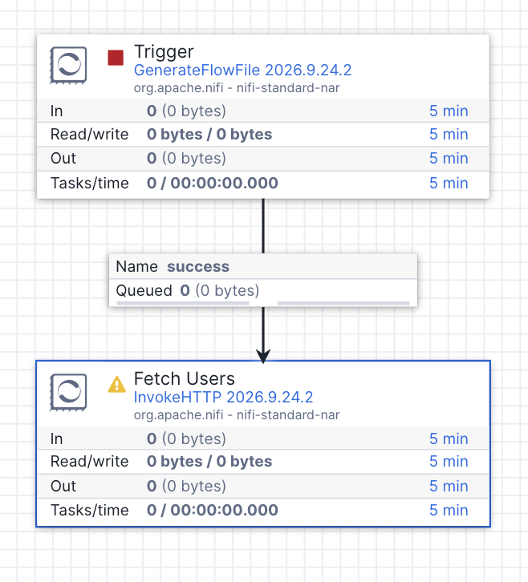
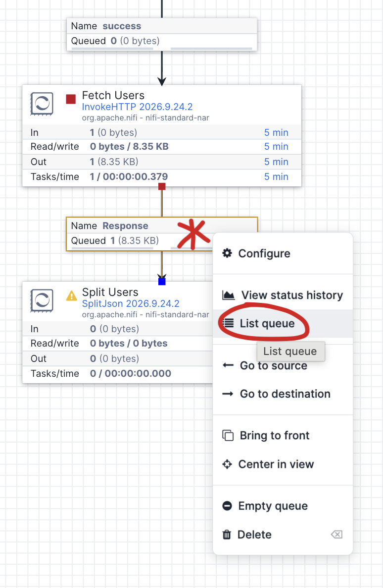
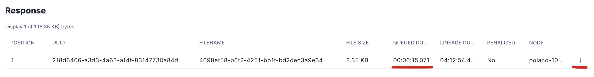
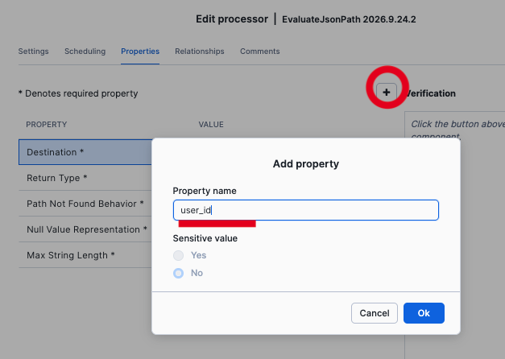

# Lab 02 - Custom HTTP API
In this lab we will build a custom flow directly on the Openflow canvas. It is more complex than just configuring a wizard but opens up unlimited flexibility with integrating different data sources. It is especially useful for integrating an HTTP REST API for which there is no existing connector provided by Snowflake.

## APIs Used

Both APIs are on the same host (`dummyjson.com`), free, no authentication required.

| API | URL |
|-----|-----|
| Users | `GET https://dummyjson.com/users?limit=30&select=id,firstName,lastName,email,address` |
| Carts | `GET https://dummyjson.com/carts/user/{userId}` |

## Building Technique

We will use a sequential build and test process which is good for learning and also just a common development technique. We will build one step, test it, check the results are as expected and keep moving forward. 

All the parameters in this exercise that must be inserted or changed are listed, everything else you can just leave the default values.

### Processor Group

Place a Processor Group on the canvas (fourth icon in the toolbar), give it a name and double click the title bar to enter

---

### Processor 1: GenerateFlowFile

This processor is used to create an empty flowfile which will serve as a trigger for our flow. We'll set scheduling to an hour to avoid it running constantly in case the processor is left running. For the lab, you will trigger it manually with right-click > **"Run once"**.

| Property | Value |
|----------|-------|
| **Name** | `Trigger` |
| **Scheduling** | Run Schedule: `1 hour` |

---

### Processor 2: InvokeHTTP

This processor invokes an HTTP GET request against the API which returns a JSON document to a flowfile

| Property | Value |
|----------|-------|
| **Name** | `Fetch Users` |
| HTTP Method | `GET` |
| HTTP URL | `https://dummyjson.com/users?limit=30&select=id,firstName,lastName,email,address` |

**Relationships:** Set terminate for Failure, No Retry, Original, Retry

**Add Connection:** Connect Step 1. `Trigger (run once)` processor -> Step 2. `Fetch Users` processor -> on attribute `success`
(Drag and Drop from middle of the first processor to the second one)



Now right-click the Trigger processor and choose Run Once from the menu. It will happen fast, to update the GUI, right click the canvas and choose Refresh. You should now see 1 flowfile queued in the success queue. This is just an empty flowfile, that we will use to trigger the whole flow.

---

### Processor 3: SplitJson

This processor will split the single large JSON document in the flowfile into several flowfiles, with one flowfile for each user in the JSON array (as specified by the JsonPath Expression)

| Property | Value |
|----------|-------|
| **Name** | `Split Users` |
| JsonPath Expression | `$.users[*]` |

**Relationships:** Set terminate for failure, original

**Add Connection:** Connect Step 2. `Fetch Users` processor -> Step 3. `Split Users` processor -> on attribute `Response`

Now we have connected the next processor, it is possible to Run Once the InvokeHTTP. This will check connectivity and make sure we setup the network rule correctly. Right-click the InvokeHTTP and choose Run Once, Refresh the canvas - if there are no problems you should see 1 flowfile in the success queue.



Right-click the queue, choose List queue and you will see a list of flowfiles for that queue. This is a useful technique for debugging and understand what is flowing through your pipeline



If you have more than one flowfile you can see the most recent by observing the queued duration. To see more details click the 3 dots context menu, where you can View details, content or Download the file. View the contents and validate you have a JSON response from the API

---

### Processor 4: EvaluateJsonPath

This processor is used to extract individual values from the JSON and write them to the flowfile attributes. To create Dynamic properties click the "+" button as shown below



| Property | Value |
|----------|-------|
| **Name** | `Extract User Info` |
| Destination | `flowfile-attribute` |
| Return Type | `auto-detect` |

**Dynamic properties** (click "+" to add each one):

| Property name | Value |
|---------------|-------|
| `user_id` | `$.id` |
| `first_name` | `$.firstName` |
| `last_name` | `$.lastName` |
| `email` | `$.email` |
| `city` | `$.address.city` |
| `country` | `$.address.country` |

**Relationships:** Set terminate for failure, unmatched

**Add Connection:** Connect Step 3. `Split Users` processor -> Step 4. `Extract User Info` processor -> on attribute `split` 

Now it's possible to "Run once" the previous processor to check it succesfully takes the JSON from a single flowfile and converts it into ~30 individual flowfiles for each user

---

### Processor 5: InvokeHTTP

| Property | Value |
|----------|-------|
| **Name** | `Fetch Cart` |
| HTTP Method | `GET` |
| HTTP URL | `https://dummyjson.com/carts/user/${user_id}` |

The `${user_id}` is NiFi Expression Language — it reads the FlowFile attribute set by Step 4. This is how we parameterize the second API call per user.

**Relationships:** Set terminate for Original, Retry, No Retry, Failure

**Add Connection:** Connect Step 4. `Extract User Info` processor -> Step 5. `Fetch Cart` processor -> on attribute `matched`

---

### Processor 6: EvaluateJsonPath

| Property | Value |
|----------|-------|
| **Name** | `Extract Cart Totals` |
| Destination | `flowfile-attribute` |
| Return Type | `auto-detect` |

**Dynamic properties:**

| Property name | Value |
|---------------|-------|
| `cart_total` | `$.carts[0].total` |
| `cart_discounted` | `$.carts[0].discountedTotal` |
| `total_products` | `$.carts[0].totalProducts` |
| `total_quantity` | `$.carts[0].totalQuantity` |

> The API returns a single cart in the carts array so we hard code the retrieval of carts[0]

**Relationships:** Set terminate for failure, unmatched

**Add Connection:** Connect Step 5. `Fetch Cart` processor -> Step 6. `Extract Cart Totals` processor -> on attribute `Response`

---

### Processor 7: UpdateAttribute

| Property | Value |
|----------|-------|
| **Name** | `Set Timestamp` |

**Dynamic properties:**

| Property name | Value |
|---------------|-------|
| `ingested_at` | `${now():format('yyyy-MM-dd HH:mm:ss')}` |

> The value we added above is an example of NiFi Expression Language, you can find more details with the [Apache NiFi Expression Language Guide](https://nifi.apache.org/docs/nifi-docs/html/expression-language-guide.html)

**Add Connection:** Connect Step 6. `Extract Cart Totals` processor -> Step 7. `Set Timestamp` processor -> on attribute `matched`

---

### Processor 8: AttributesToJSON

| Property | Value |
|----------|-------|
| **Name** | `Build Record` |
| Attributes List | `user_id,first_name,last_name,email,city,country,cart_total,cart_discounted,total_products,total_quantity,ingested_at` |
| Destination | `flowfile-content` |
| Include Core Attributes | `false` |
| Null Value | `false` |

**Relationships:** Set terminate for failure

**Add Connection:** Connect Step 7. `Set Timestamp` processor -> Step 8. `Build Record` processor -> on attribute `success`

> **Why this step?** PublishSnowpipeStreaming reads FlowFile **content** as records (via the Record Reader). The previous steps stored data in FlowFile **attributes**. This processor converts those attributes into a flat JSON object in the FlowFile content so the Record Reader can parse it.

---

### Create Supporting Controller Services

The next processor we will use, PublishSnowpipeStreaming requires two controller services. Create and enable them now.

**How to create a controller service:**
1. Right-click on empty canvas space inside your Process Group
2. Select **"Controller Services"**
3. Click the **"+"** button
4. Search for the service type, select it, click **Add**
5. Click the **three dots** and **Enable** it (Choose only Services from the Dropdown)

| # | Type to search | Notes |
|---|---------------|-------|
| 1 | `JsonTreeReader` | Parses JSON content into records. Default settings are fine. |
| 2 | `StandardWebClientServiceProvider` | HTTP client used by PublishSnowpipeStreaming. Default settings are fine. |

Go Back to the Canvas.

---

### Processor 9: PublishSnowpipeStreaming

| Property | Value |
|----------|-------|
| **Name** | `Write to USER_SPENDING` |
| **Processor type** | `PublishSnowpipeStreaming` |
| Authentication Strategy | `SNOWFLAKE_MANAGED` |
| Database | `OPENFLOW` |
| Schema | `PUBLIC` |
| Table | `USER_SPENDING` |
| Web Client Service Provider | *(select the StandardWebClientServiceProvider you created)* |
| Transfer Strategy | `ROWS` |
| Channel Type | `Standard` |
| Offset Tracking Resolution | `FLOW_FILE` |
| Offset Token End Expression | `${user_id}` |
| Channel Group | `SHARED` |

**Relationships:** Set terminate for success, failure, invalid, empty

**Add Connection:** Connect Step 8. `Build Record` processor -> Step 9. `Write to USER_SPENDING` processor -> on attribute `success`

> **About the Pipe name:** PublishSnowpipeStreaming writes through a PIPE object, not directly to a table. The pipe is auto-created by Snowflake on first use. You do NOT need to create it manually.

> **About Authentication Strategy:** When set to `SNOWFLAKE_MANAGED`, the processor uses the runtime's built-in session token. No Account, User, Role, or Private Key configuration is needed — those fields can be left empty or set to any value. The session token is build based on the Runtime Execute-as-Role proerty, we use OPENFLOW_ADMIN Role here.

> **About Offset Tokens:** These track which records have been committed (for delivery guarantees). They must be **numeric**. We use `${user_id}` because it's already available as an attribute, is numeric (1-30), and is meaningful. In production you'd use a Kafka offset or sequence number.

> **Reloading data after a mistake:** Because we use `user_id` as the offset token, the processor remembers which user IDs have already been committed. If you need to reload the data (e.g., wrong config on first run), simply **truncate the target table** and the processor will re-send all records on the next trigger:
> ```sql
> TRUNCATE TABLE OPENFLOW.PUBLIC.USER_SPENDING;
> ```
> The offset tracking resets when the table is truncated.

---

### Create the target table OPENFLOW.PUBLIC.USER_SPENDING

In Snowflake create the target table using

```
-- Depending on how you setup Openflow you may need to adjust roles below
USE ROLE OPENFLOW_ADMIN;
GRANT CREATE TABLE ON SCHEMA OPENFLOW.PUBLIC TO ROLE OPENFLOW_RUNTIME;

USE ROLE OPENFLOW_RUNTIME;
CREATE OR REPLACE TABLE OPENFLOW.PUBLIC.USER_SPENDING (
    USER_ID             NUMBER,
    FIRST_NAME          VARCHAR,
    LAST_NAME           VARCHAR,
    EMAIL               VARCHAR,
    CITY                VARCHAR,
    COUNTRY             VARCHAR,
    CART_TOTAL          FLOAT,
    CART_DISCOUNTED     FLOAT,
    TOTAL_PRODUCTS      NUMBER,
    TOTAL_QUANTITY      NUMBER,
    INGESTED_AT         VARCHAR
);
```

---

### Executing the flow

We are now ready to test our complete flow. "Run once" is useful for testing individual elements but the PublishSnowpipeStreaming needs to be run continuously to manage the more complex confirmation and commit functionality.

Start all the processors apart from the first Trigger processor to "Run". Preview the target table to validate all ~30 rows reached the target. Offset tracking in Snowpipe Streaming prevents loading the same user_id more than once. You can run an end-to-end test by Truncating the target table and executing a "Run once" on the first Trigger processor