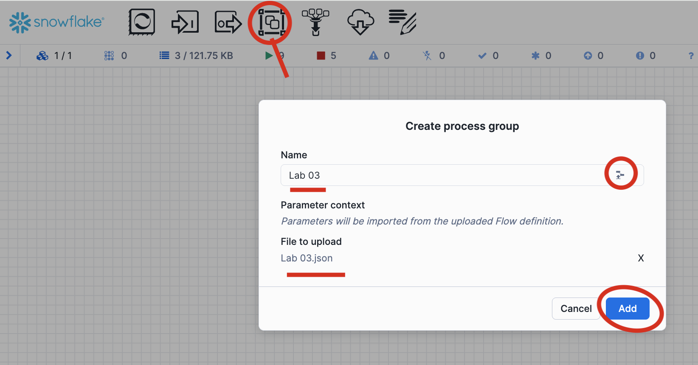
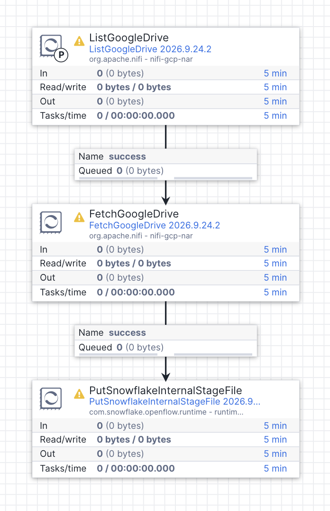
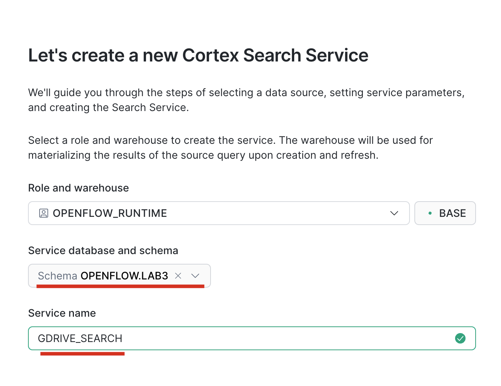
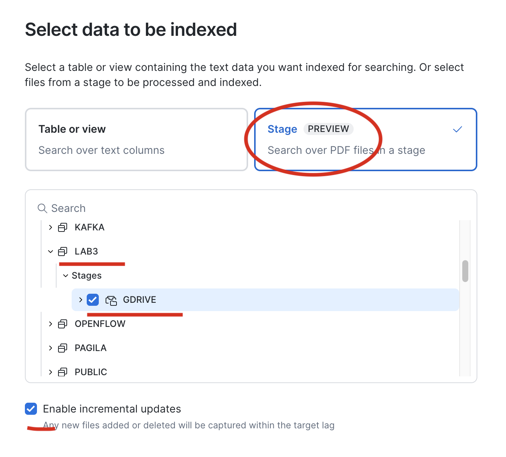
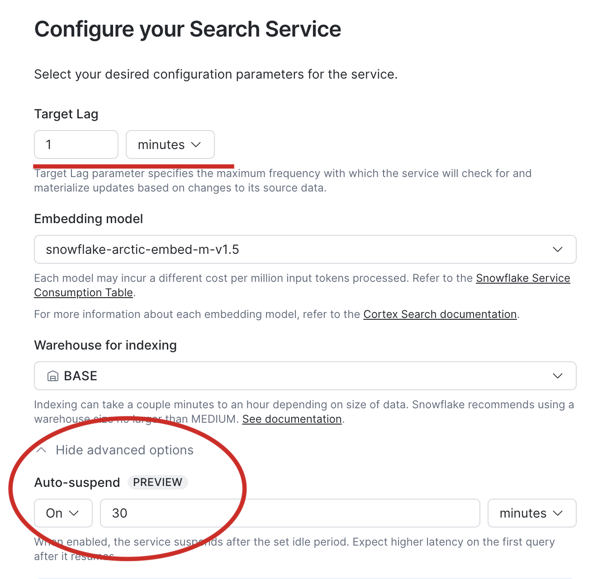
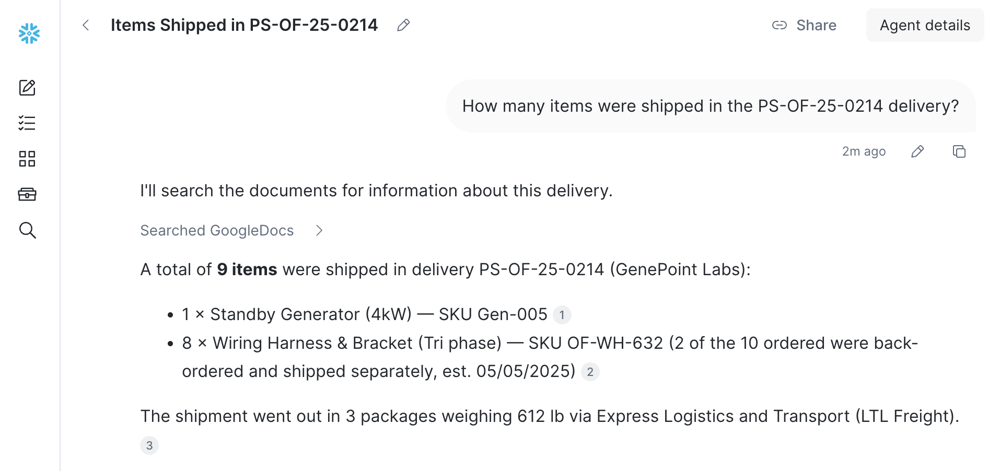

# Lab 03 - Unstructued Data
Openflow has a range of connectors designed to ingest documents from Unstructued sources such as Google Drive, Sharepoint, Box, etc. They are designed for Enterprise use and require appropriate setup of credentials and permissions.

For this lab we will use a pre-built custom flow that uses core NiFi connectivity that can connect to a regular/personal Google Drive account to simulate ingestion from an enterprise unstructured source.

> 💡 Ensure you created the Network rule described in [Lab 00](Lab%2000%20-%20Initial%20Setup.md) to allow access to the Google Services we will use for the lab

## Download flow template

First Download the [Lab 03 Openflow flow design](Lab%2003.json) file to your local PC.

On the Openflow canvas GUI, drag a Processor Group onto your root canvas, on the right of the name input field click the indicated icon to browse for the flow definition. Selected the downloaded JSON from the previous step, confirm/configure the name and click **"Add"**



Double-click to enter the Process Group, you should find a simple flow consisting of just 3 processors. 



The first processor **ListGoogleDrive** connects to Google Drive and gets a file listing, creating one empty flow file for each file in the identified folder using attributes to store metadata about the source file.

The second processor **FetchGoogleDrive** actually retrieves the source file identified by '${drive.id}' - default settings are used to convert all Google Docs, Sheets, Slides into PDFs

Finally the third processor **PutSnowflakeInternalStageFile** is used to PUT the retrieved file into a Snowflake stage `OPENFLOW.LAB3.GDRIVE` which we must now create to be ready to execute. We will also allow task execution for our Openflow runtime role (needed for later)

```
USE ROLE OPENFLOW_RUNTIME;
CREATE SCHEMA OPENFLOW.LAB3;
CREATE STAGE OPENFLOW.LAB3.GDRIVE ENCRYPTION = (TYPE = 'SNOWFLAKE_SSE');

USE ROLE ACCOUNTADMIN;
GRANT EXECUTE TASK ON ACCOUNT TO ROLE OPENFLOW_RUNTIME;

```


As well as the 3 processors, the flow contains the configuration for two controller services. Right click the empty canvas and choose "Controller Services" to view them

| Controller service | Description |
|----------|-------|
| **GCPCredentialsControllerService** | A service to manage Google authentication |
| **SnowflakeConnectionService** | Manages connectivity to Snowflake |

The SnowflakeConnectionService is set to use "Snowflake Managed Token" authentication, which uses an SPCS session token so it requires no configuration. Choose **"Enable"** from the context menu to start the service.

To configure the GCP credentials we need to insert the Service Account JSON containing the keys for access to a shared GDrive folder. Run this command in Snowflake together with the password to get the JSON payload

```
SELECT TO_VARCHAR(DECRYPT(TO_BINARY(
'KcgvFYeePEWUix2mQkQZvLg7VLiCQlQ9cRUU5dLaaBnKO8UwbHugdpdaVOWO/P1bT0gN/KSSN8ikq19opvpXhkXyIE4Cqcn32G5pM7YGqBq/wZc2tmyBsqURfvYne6iDiboYrdVprzeGebRWwDdJ1dqCNG1SHL3M++ZlPhx2G6EeeIgGo7uI5JDsYfx7rn21dXVGd2zUzWl5Go4OjophfeSuh8XTGP6J7pPtDAJkDC9ilf51M75HqAP+qMPosBDdMoezTXqQOELgI4jdwgA7W/EaE2LYsA1Qdp8lEQPvHLuW28mL9YyMe/dhN2NRxDtkIkjrHADUUHzfRmWqivDaquxOpUByr8mz0ywuGFekQl1OWvqlXUNzdDROz1PXejwr4sqK2hoYZ7XhmpD0dguPwLdWkLWWjl9b4W0TKrPVlicUWAvSQTeV1FgA1izGmFhi3ITqjmi4aGex363AFm49U+xXzIZ/Qui87dvZBtLJ9Epgy/pM8F1pquS5J/WdLqvW6LGRe/vWGzu8CjWZZVxeqZbaiSKMjsm80o1G87bVJ/Vo6tkbyeWo37njMiUoAKqrtMO4NFYAWWlzKVB0JprQsKRbuY64NAxyeZT2lLXDGvZWaFLmQBeJycekQ+TgKzmCu/Jj8TWeHSy0/Kdk+4v6Id130EO9mZ9Jkzv4kvGe0wjmmLwCY9ve5Etv9NFkfMD5iT/XLgxX0Bz/ydAnuVEhBmMDToBKwe+ALI0goXBWSxtuP+93ShUnljwZwvTQy5YsibRGHGjlhQyuOUgQsYk3OGtvBOVJ7M+bd/Zgfi1DgYFUOXu1sbOI+IYsqe+qLSoN3chzV29O5o4y0R8Koh9Hn8InkWZNmc+wtjkz2HnpHsx5YD2/M77BHhzCy1za+omBfeC2mRN/lm1slMURnnnh0vEj3n6e8hOW69wFI9rqb+83FHaGg9rlSxe8fMaOPvOH72SD4zcg0Zt3Iz37npuJfQFYM7CxJP8pFhUhvB4dAe2STijtBBOa82uJkLp2xsEVScUeZZRafkDmzPUSDijQQz+9hAo1kFMbgr+0R5DwjlwmOhr+KcaM6L9+Xyb4fsO7daclxerTJN/J8MRNmQivjMZK8fAmGuHWhCmb6Qfby3W9mFudnst5EcVlB5BR4V+MvJBTIWXBUuWi3rqTVSeU4ru1uuQ1V+KrCh1x4DyZSPT+rfayXInVq3KBsXlXHWCkB7WXjkwk2tLlDhZ6D5ptmWPryFsT+zoT4oRTLs7q7dTU/6+lv8CStj/MSjjkLCJUpCjP8WbB6f04uFNUsz97xCfseBh0N02gvLCJmcVAIH1rRXr6P5eYmfc9XIlzh6LFeLVrNKpHeQ0HAvHnv8r6nNybKZkc+X98MwnlU7iiBoenJffnywTfNuBvMjM31M8aYKVkC3XVLashbTz3wDXqNDtsRtR/SprCW4fG2uwD4ds3tp5bhgCN4lS9hgaWe6shGkGaEVcdqjkpQuq+faJQHf016EVgz7T+LaCW7Fejjgk53LuIQkhyh5GuwqJRbou4kpRlJBxvgtNrpKlPvV6w/K3jeNk5CqK6KKTr21nV3PAiAC5cMck5Z9oVGJMe7h9bGbm6oSLz2suWGM8G0ovKll12A0dS978iEjn38veLVsj/e+BOYiith59ciqcCKpdPHqOxBzBwIMgc/GrmnX/jqIiG4TtHGItzzPvx5o3buBub3FZxfUOSikKNYc5yXUfrHQxQJug3tyTXa+vtUlZko4IVwdEXoFHVdRhKggGXPcW7Z9zaZkz7A0LNhy2AHIIy6vQcc/yIeiYpXOlN4q7cmBNCcdkWqLPYVn+kKZGH9c9m96K4yBV3j5z/0NctbQCzw6m3EqD3vULgav8np0wBKwV2FPVGsAbTszCH6bYWKH86MLY3naQNfbV0sBTUV5+OGqfQd351FDE8iSevwU7kkj+FkG/LPHOM9u2f4YQlcGQTXhru3ETveE3PKgpf91DmAkIQi+g0tzhN0/qNBmJ9lfoKy9mo77nysYCDo6ZKpSLqc6G9yRghn05qTEJ+UgLwKTD0hQ/zOA65xKqrh2+1PMn/DFhw/y4wMaBY0a2t3uYa1lBTRMqTtSZVzANZ+B2gQlDkhtW8vj9cvdYUrzaXDg6OPxn2//UJ1SZoIf/2E5CSsi/j9HV4L5mk9w0mqusIp2D/RjsBKqP7VKZt1Nsiq5eoJUHjzSYmRivHElueiOHBlcwMtw/soU1YVkw9p/2bbR7oQh+YXY6D+eE0Fna7TjCM++IepZ8tv3UZjoiPsgrdVUzx147/lmqTS3g0arOS0sjp3gy8o+tNbxtR3RBYtXV9ZBs6jrAiIe3YFlq+GXWyG+vJl7F2Fpf/2LwWz8LAGCcSNKuiRLSS/NYP+empMRyLR3CTgqzWkxtx4wzvh9LLghmyRr68zeWK1AuYqRXYEN6AkSdxKlrcKkliSZ+C5C9yrJwbZVNuaIb79dWZtPzDSpaN4w+snPOfgQ45/pzTMrkawHoK3m0zVLu3g8bo0//Fm+5IoHH7ree7g/iVpPyrc2IEvJgQuoCLj+nX4pp0el85VWZriS0UzEBm+asYBR1S0ySiR31LH9hYPe3PZyA+da4zMco2T+zYGeCl9nMGtocAGDBpDKEmOYe+2cTHxeMSk0nuxaIj3/l79zj6fMgD93fVO581ml0ZkQM675YhB7xzajgzNRHBPNbINMgSP216WCzKOhYrJMvnrE0H8/13QVuqW0OnwVLqxJeMvXp7RFVuxkHat0kBmiiSHY61mm9jABNxxGCbH0ArpEYlaVmERQe2AVgU9oTf+I4cYXNlGsr+RMVjfPtrl1kmBj8imQxInhIUnQSrmNbq+oDWikVMBNesimKI3kWEtvp4/g9hXDyTvILH/C8YfcYjyPneE9bObyDymAaye1eVHu1w5pWCIfsGSUSkpnbvqu0GV869G1PL+uZN6r9NZkFGNlr4sRRGTTUlijT9JSQfWIx5c25AmA68pKPUZ1wLzeJ17sVFjopS500SfSXp2u0MEWJHY43JUbl2+mnhZKX9bRkmKrIPIlHGTPaBZJ0W+2yP7ko6Ii6y/99E1pehX/g5In0csjtwp8BPWLUJ2ViYn7Acxy/1g3kWp0vOP0VbPJofUoKjyzzXEgEMlnm06MOn4RqKb9meXNPt51V4FLUPGLOvkpwAqIqE+/ld/6J/XCo=', 'BASE64'),
'<insertpasswordhere>'),
'UTF-8') AS json_creds;
```

Edit the **GCPCredentialsControllerService** and paste the decrypted JSON into the "Service Account JSON" property. Save and Enable the service. Now start the whole processor group by right clicking and choosing Start or start the processors individually to check (you can also use "Run Once" to observe the behaviour)

> Navigate to the Snowflake Stage `OPENFLOW.LAB3.GDRIVE` to validate the documents were successfully loaded - create a directory table if necessary in Snowsight to view the document list with the UI

# Create Cortex Services for RAG Pipeline

Official Snowflake unstructured connectors have the option to create Cortex Services to help enable the end-to-end RAG pipeline. We will create them manually using Snowsight. From the menu choose Cortex AI -> Search then click the **"Create"** button (make sure you are using the OPENFLOW_RUNTIME role in Snowsight)



We will use the Preview functionality that allows a Cortex search service to source PDFs directly from a Stage



Configure indexing with a Target Lag of 1 minute (good for demoing) and we'll also use the preview functionality with auto-suspends indexing (also good for demo envs)



# Testing the RAG Pipeline

Using Snowsight, test the Cortex Search Service using the Playground. If you have time create an agent around the Cortex Search service and test it in CoWork!

Can it answer the question `How many items were shipped in the PS-OF-25-0214 delivery?`

