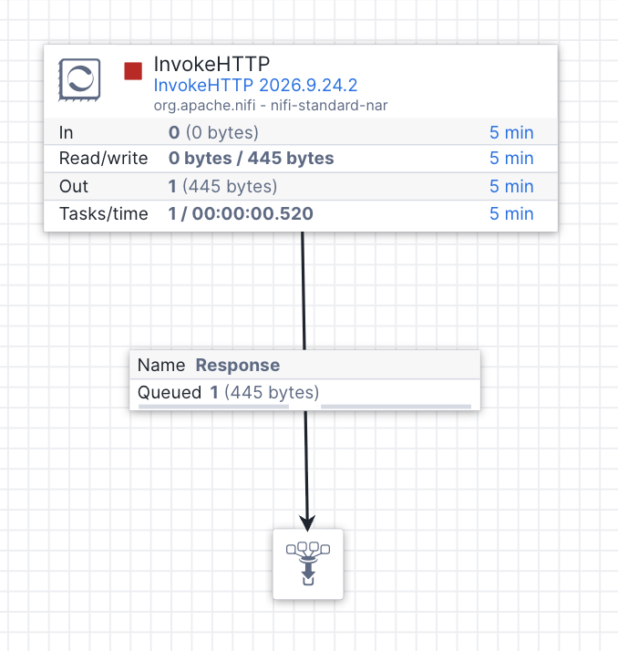

# Lab 04 - Data Connectivity Proxy

The Data Connectivity Proxy (DCP), now generally available, lets Openflow connect to data sources on-premises or in other locations behind a firewall. The DCP agent is a local containerised process that makes an outbound connection to Snowflake, creating an encrypted tunnel through which Openflow can reach your private endpoints - no inbound firewall ports are required. For full information, check the [official documentation](https://docs.snowflake.com/en/user-guide/data-connectivity-proxy)

First we must set up the network rule which maps a hostname and port from Openflow SPCS to the proxy, and package it in an External Access Integration (EAI)

```sql
-- DCP network rules use the network rule mode: DATA_CONNECTIVITY_PROXY_EGRESS

USE ROLE ACCOUNTADMIN;
CREATE OR REPLACE NETWORK RULE localport
  MODE = DATA_CONNECTIVITY_PROXY_EGRESS
  TYPE = HOST_PORT
  VALUE_LIST = ('my.internal:8080');    -- route the hostname my.internal (port 8080) via the proxy

DESC NETWORK RULE localport;

-- Package the network rule in an EAI and grant USAGE
CREATE OR REPLACE EXTERNAL ACCESS INTEGRATION DCP_EAI
  ALLOWED_NETWORK_RULES = (localport)
  ENABLED = TRUE;

GRANT USAGE ON INTEGRATION DCP_EAI TO ROLE openflow_admin;
GRANT USAGE ON INTEGRATION DCP_EAI TO ROLE openflow_runtime;
```

Now we need to create the DCP object in Snowflake and issue the account-level TLS certificates the agent uses

```sql
CREATE DATA CONNECTIVITY PROXY IF NOT EXISTS MY_DCP
  EXTERNAL_ACCESS_INTEGRATIONS = (DCP_EAI)
  ENABLED = TRUE;

SHOW DATA CONNECTIVITY PROXIES; -- check creation

SELECT SYSTEM$ISSUE_PER_ACCOUNT_CERTIFICATES();
```

> ⚠️ Certificate issuance is asynchronous. The first time this is run in an account, wait at least 30 minutes before starting the agent. Running it again has no additional effect.

Initial connectivity is handled via a bootstrap JWT token. Create one using the following SQL with a 90 day validity, then copy the output and save it to a local file

```sql
SELECT SYSTEM$GENERATE_DATA_CONNECTIVITY_PROXY_BOOTSTRAP_TOKEN('MY_DCP', 90);
```

Finally, attach the EAI to your Openflow runtime so that flows are allowed to open connections to the destination. In the Openflow runtime list, click the 3 dot context menu next to your runtime -> **External access integrations**, add `DCP_EAI` (keep `OPENFLOW_EAI` selected too) and click **Save**

# Container Setup

The DCP agent runs as a container, using OCI-compliant software such as [Docker](https://www.docker.com/) or [Podman](https://podman.io/). The image is hosted on [Docker Hub](https://hub.docker.com/r/snowflakedb/dcp-client)

Update the command below for your container software of choice and make sure the `-v` option points to your local JWT token file (`/Users/me/dcp-bootstrap-token` in this example)

```bash
docker run --rm -it \
 --name snowflake-dcp-agent \
 --add-host my.internal:host-gateway \
 -v /Users/me/dcp-bootstrap-token:/etc/dcp-agent/secrets/dcp-bootstrap-token:ro \
 -e DCP_METRICS_PORT=9092 \
 -p 9092:9092 \
 snowflakedb/dcp-client:latest
```

The `--add-host` option maps `my.internal` to your host machine, so traffic arriving through the tunnel for `my.internal:8080` reaches the mock endpoint we start below.

Once the agent has started without obvious errors in the output, confirm it is connected:

* In Snowflake, run `DESCRIBE DATA CONNECTIVITY PROXY MY_DCP;` and check that `AGENT_HEALTH` is `HEALTHY`
* View the [Prometheus metrics page](http://localhost:9092/metrics) and look for the agent connectivity status line `agent_cp_connected 1`

For this lab we will use a Python script to act as a mock HTTP endpoint running on our local machine. Download the [mock_endpoint.py](mock_endpoint.py) script and run it with `python3 mock_endpoint.py`. It listens on port 8080 and echoes back details of any HTTP request it receives

Build a simple flow using an InvokeHTTP processor as we did in Lab 02 and route the **Response** relationship to a funnel so we can view the results



Configure the InvokeHTTP processor's **HTTP URL** to use this endpoint:
`http://my.internal:8080/this/is/a/test`

Openflow SPCS captures the request for hostname and port `my.internal:8080` and routes it via the DCP, as per the network rule we configured above. Execute the HTTP request using **Run once** and observe the connection in the DCP agent output and the mock endpoint output.

🥳 Congratulations! 🥳 You have connected Openflow running in Snowflake to a local endpoint running on your machine
